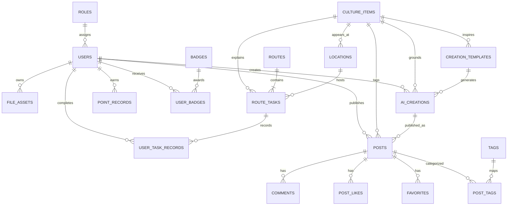

# 数据库 ER 图

文化条目 `culture_items` 是业务中心，路线任务、地点、AI 作品和社区帖子均可关联它。积分流水与用户任务记录通过唯一约束保证重复请求不重复奖励。

## 幂等与一致性约束

- `user_task_records(user_id, task_id)` 唯一：同一任务只完成一次。
- `point_records(user_id, business_key)` 唯一：同一业务事件只记一笔积分。
- `post_likes(post_id, user_id)` 唯一：同一用户不能重复点赞。
- `favorites(post_id, user_id)` 唯一：同一用户不能重复收藏。
- `user_badges(user_id, badge_id)` 唯一：同一徽章只授予一次。
- `route_tasks(route_id, order_no)` 唯一：路线节点顺序不重复。
- 所有时间由后端按 UTC 写入，通过 API 输出 ISO 8601。

